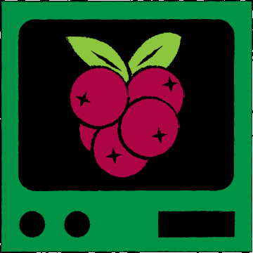

# SANS Holiday Hack Challenge 2022 - KringleCon V: Golden Rings
## KringleCon Orientation
Difficulty: :christmas_tree:
Get your bearings at KringleCon  
1. **Talk to Jingle Ringford**: Jingle will start you on your journey!
2. **Get your badge**: Pick up your badge
3. **Get the wifi adapter**: Pick up the wifi adapter
4. **Use the terminal**: Click the computer terminal

### (Kind of) Solution
* The Elf:   
* The Badge:   
* The Wallet Address: ```0x4a831cfc7fD1A983b4AF04CfbF5da984bD6f7E7E```
* The Terminal: 
* The Santa: 

---
## Recover the Tolkien Ring
### Wireshark Practice
### Windows Event Logs
### Suricata Regatta
### The Tolkien Ring
## Recover the Elfen Ring
### Clone with a Difference
### Prison Escape
### Jolly CI/CD
### The Elfen Ring
## Recover the Web Ring
### Naughty IP
### Credential Mining
### 404 FTW
### IMDS, XXE, and Other Abbreviations
### Open Boria Mine Door
### Glamtariel's Fountain
### The Web Ring
## Recover the Cloud Ring
### AWS CLI Intro
### Trufflehog Search
### Exploitation via AWS CLI
## Recover the Burning Ring of Fire
### Buy a Hat
### Blockchain Divination
### Exploit a Smart Contract
### Mistakes were made... the key
### The Burning Ring of Fire
## [Narrative](/README.md#narrative)
## [Conclusions](/README.md#conclusions)
### [The Victors shop](/README.md#the-victors-shop)
### [Inbox (1)](/README.md#inbox-1)
---
## [thedead@dellian:~$ whoami](/README.md#thedeaddellian-whoami)