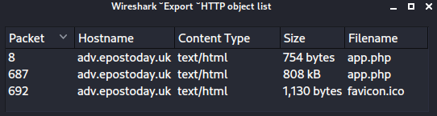

# SANS Holiday Hack Challenge 2022 - KringleCon V: Golden Rings
## Recover the Tolkien Ring
### Wireshark Practice
Difficulty: :christmas_tree:  
Use the Wireshark Phishing terminal in the Tolkien Ring to solve the mysteries around the [suspicious PCAP](https://storage.googleapis.com/hhc22_player_assets/suspicious.pcap). Get hints for this challenge by typing hint in the upper panel of the terminal.

#### Solution
Please note that I used both the file `suspicious.pcap`, downloaded from above URL, and `pcap_challenge.pcap`, present inside the terminal. Their `md5` hashes match and are `f0450df7d1bf6e695f80a61259083307`.

##### Question 1 - What type of objects can be exported from this PCAP? - Answer: `http`
The Wireshark “Export objects” functionality finds only HTTP exportable objects:  
  
Interestingly enough there are 2 `app.php` files of different sizes. `Diff`ing the two files it is possible to observe a base64 encoded payload.

##### Question 2 - What is the file name of the largest file we can export? - Answer: `app.php`
Wireshark’s “Export HTTP object list” window also shows filenames.

##### Question 3 - What packet number starts that app.php file? - Answer: `687`
Wireshark’s “Export HTTP object list” window also shows the initial packet for the file download.

##### Question 4 - What is the IP of the Apache server? - Answer: `192.185.57.242`
Filter on the packet number and get the source IP:
```bash
elf@2c6b9deef396:~$ tshark -r pcap_challenge.pcap -T fields -e ip.src "frame.number == 687"
192.185.57.242
```

##### Question 5 - What file is saved to the infected host? - Answer: `Ref_Sept24-2020.zip`
By analyzing the modified `app.php` it is possible to notice that some JS code was added. This chunk of code contains a base64 encoded payload that gets decoded and downloaded with abovementioned filename:
```js
saveAs(blob1, 'Ref_Sept24-2020.zip');
```
The zip file contains a file named `Ref_Sept24-2020.scr` which is recognized by [multiple AV solutions](https://www.virustotal.com/gui/file/fad001d463e892e7844040cabdcfa8f8431c07e7ef1ffd76ffbd190f49d7693d) as being `Dridex` malware.

##### Question 6 - Attackers used bad TLS certificates in this traffic. Which countries were they registered to? - Answer: `Irelan, Israel, South Sudan`
It is possible to extract all the countries with `tshark` and some commands:
```bash
elf@2c6b9deef396:~$ tshark -r pcap_challenge.pcap -V | grep "DNSequence item: 1 item (id-at-countryName=" | cut -d = -f 2 | cut -d ")" -f1 | sort | uniq
IE
IL
SS
US
```
These four countries map to: IE ➤ Ireland, IL ➤ Israel, SS ➤ South Sudan, US ➤ United States. At this
point it is enough to order them excluding the pretty obvious “United States” from the list.

##### Question 7 - Is the host infected (Yes/No)? - Answer: `Yes`
It is possible to observe that after the malicious content is retrieved, the host does a connection to `adv.epostoday.uk` which is a [known Dridex IOC](https://github.com/Esox-Lucius/PiHoleblocklists/blob/main/Dridex%20IOCs%20-%20Domains%20%26%20Hosts):
```bash
elf@2c6b9deef396:~$ tshark -r pcap_challenge.pcap -V "frame.number > 687 && ip.src == 10.9.24.101 && dns" | grep "type A" | cut -d " " -f9 | cut -d ":" -f 1 | sort | uniq
adv.epostoday.uk
array807.prod.do.dsp.mp.microsoft.com
array811.prod.do.dsp.mp.microsoft.com
cp801.prod.do.dsp.mp.microsoft.com
disc801.prod.do.dsp.mp.microsoft.com
dns.msftncsi.com
edge.microsoft.com
geo.prod.do.dsp.mp.microsoft.com
kv801.prod.do.dsp.mp.microsoft.com
localdomain.localdomain
v10.events.data.microsoft.com
wpad.localdomain
www.bing.com
```

---
### [Windows Event Logs (Recover the Tolkien Ring)](/02%20-%20Recover%20the%20Tolkien%20Ring/02.02%20-%20Windows%20Event%20Logs/README.md)
### [Suricata Regatta (Recover the Tolkien Ring)](/02%20-%20Recover%20the%20Tolkien%20Ring/02.03%20-%20Suricata%20Regatta/README.md)
### [The Tolkien Ring (Recover the Tolkien Ring)](/02%20-%20Recover%20the%20Tolkien%20Ring/02.04%20-%20The%20Tolkien%20Ring/README.md)
### [Clone with a Difference (Recover the Elfen Ring)](/03%20-%20Recover%20the%20Elfen%20Ring/03.01%20-%20Clone%20with%20a%20Difference/README.md)
### [Prison Escape (Recover the Elfen Ring)](/03%20-%20Recover%20the%20Elfen%20Ring/03.02%20-%20Prison%20Escape/README.md)
### [Jolly CI_CD (Recover the Elfen Ring)](/03%20-%20Recover%20the%20Elfen%20Ring/03.03%20-%20Jolly%20CI_CD/README.md)
### [The Elfen Ring (Recover the Elfen Ring)](/03%20-%20Recover%20the%20Elfen%20Ring/03.04%20-%20The%20Elfen%20Ring/README.md)
### [Naughty IP (Recover the Web Ring)](/04%20-%20Recover%20the%20Web%20Ring/04.01%20-%20Naughty%20IP/README.md)
### [Credential Mining (Recover the Web Ring)](/04%20-%20Recover%20the%20Web%20Ring/04.02%20-%20Credential%20Mining/README.md)
### [404 FTW (Recover the Web Ring)](/04%20-%20Recover%20the%20Web%20Ring/04.03%20-%20404%20FTW/README.md)
### [IMDS, XXE, and Other Abbreviations (Recover the Web Ring)](/04%20-%20Recover%20the%20Web%20Ring/04.04%20-%20IMDS,%20XXE,%20and%20Other%20Abbreviations/README.md)
### [Open Boria Mine Door (Recover the Web Ring)](/04%20-%20Recover%20the%20Web%20Ring/04.05%20-%20Open%20Boria%20Mine%20Door/README.md)
### [Glamtariel's Fountain (Recover the Web Ring)](/04%20-%20Recover%20the%20Web%20Ring/04.06%20-%20Glamtariel's%20Fountain/README.md)
### [The Web Ring (Recover the Web Ring)](/04%20-%20Recover%20the%20Web%20Ring/04.07%20-%20The%20Web%20Ring/README.md)
### [AWS CLI Intro (Recover the Cloud Ring)](/05%20-%20Recover%20the%20Cloud%20Ring/05.01%20-%20AWS%20CLI%20Intro/README.md)
### [Trufflehog Search (Recover the Cloud Ring)](/05%20-%20Recover%20the%20Cloud%20Ring/05.02%20-%20Trufflehog%20Search/README.md)
### [Exploitation via AWS CLI (Recover the Cloud Ring)](/05%20-%20Recover%20the%20Cloud%20Ring/05.03%20-%20Exploitation%20via%20AWS%20CLI/README.md)
### [The Cloud Ring (Recover the Cloud Ring)](/05%20-%20Recover%20the%20Cloud%20Ring/05.04%20-%20The%20Cloud%20Ring/README.md)
### [Buy a Hat (Recover the Burning Ring of Fire)](/06%20-%20Recover%20the%20Burning%20Ring%20of%20Fire/06.01%20-%20Buy%20a%20Hat/README.md)
### [Blockchain Divination (Recover the Burning Ring of Fire)](/06%20-%20Recover%20the%20Burning%20Ring%20of%20Fire/06.02%20-%20Blockchain%20Divination/README.md)
### [Exploit a Smart Contract (Recover the Burning Ring of Fire)](/06%20-%20Recover%20the%20Burning%20Ring%20of%20Fire/06.03%20-%20Exploit%20a%20Smart%20Contract/README.md)
### [Mistakes were made… the key (Recover the Burning Ring of Fire)](/06%20-%20Recover%20the%20Burning%20Ring%20of%20Fire/06.04%20-%20Mistakes%20were%20made…%20the%20key/README.md)
### [The Burning Ring of Fire (Recover the Burning Ring of Fire)](/06%20-%20Recover%20the%20Burning%20Ring%20of%20Fire/06.05%20-%20The%20Burning%20Ring%20of%20Fire/README.md)
### [Narrative](/README.md#narrative)
### [Conclusions](/README.md#conclusions)
---
### [thedead@dellian:~$ whoami](/README.md#thedeaddellian-whoami)
### [KringleCon Orientation](/01%20-%20KringleCon%20Orientation/README.md)