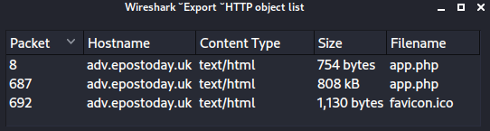

# SANS Holiday Hack Challenge 2022 - KringleCon V: Golden Rings
## Recover the Tolkien Ring
### Wireshark Practice
Difficulty: :christmas_tree:

Use the Wireshark Phishing terminal in the Tolkien Ring to solve the mysteries around the [suspicious
PCAP](). Get hints for this challenge by typing hint in the upper panel of the terminal.

### Solution
Please note that I used both the file `suspicious.pcap`, downloaded from above URL, and `pcap_challenge.pcap`, present inside the terminal. Their `md5` hashes match and are `f0450df7d1bf6e695f80a61259083307`.

#### Question 1 - What type of objects can be exported from this PCAP? - Answer: `http`
The Wireshark “Export objects” functionality finds only HTTP exportable objects:

---
### Windows Event Logs
### Suricata Regatta
### The Tolkien Ring
## Recover the Elfen Ring
### Clone with a Difference
### Prison Escape
### Jolly CI/CD
### The Elfen Ring
## Recover the Web Ring
### Naughty IP
### Credential Mining
### 404 FTW
### IMDS, XXE, and Other Abbreviations
### Open Boria Mine Door
### Glamtariel's Fountain
### The Web Ring
## Recover the Cloud Ring
### AWS CLI Intro
### Trufflehog Search
### Exploitation via AWS CLI
## Recover the Burning Ring of Fire
### Buy a Hat
### Blockchain Divination
### Exploit a Smart Contract
### Mistakes were made... the key
### The Burning Ring of Fire
## [Narrative](/README.md#narrative)
## [Conclusions](/README.md#conclusions)
### [The Victors shop](/README.md#the-victors-shop)
### [Inbox (1)](/README.md#inbox-1)
---
## [thedead@dellian:~$ whoami](/README.md#thedeaddellian-whoami)
## KringleCon Orientation