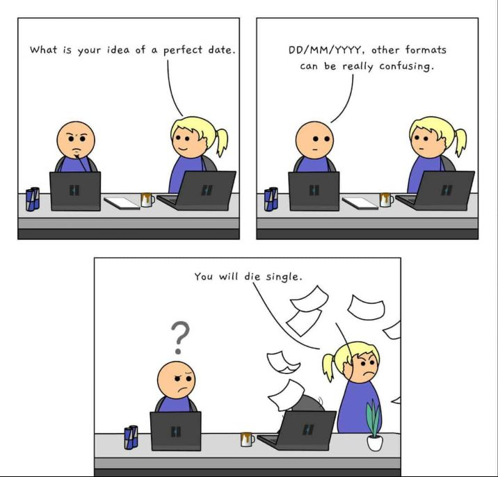

# SANS Holiday Hack Challenge 2022 - KringleCon V: Golden Rings
## Recover the Tolkien Ring
### Windows Event Logs
Difficulty: :christmas_tree::christmas_tree:

Investigate the Windows [event log](https://storage.googleapis.com/hhc22_player_assets/powershell.evtx) mystery in the terminal or offline. Get hints for this challenge by typing
hint in the upper panel of the Windows Event Logs terminal.

#### Hints
* Built-In Hints
** From: Sparkle Redberry
** The hardest steps in this challenge have hints. Just type `hint` in the top panel!
* Event Logs Exposé
** From: Sparkle Redberry
** New to Windows event logs? Get a jump start with [Eric's talk](https://youtu.be/5NZeHYPMXAE)!

#### Solution
Please note that I used `evtx_dump.py`([python-evtx](https://pypi.org/project/python-evtx/)) to convert logs in a more readable format, the filename that will be used in commands is `powershell.evtx.dump`.

##### Question 1 - What month/day/year did the attack take place? - Answer: `12/24/2022`
Assuming there were multiple actions via PowerShell during the attack, I counted the number of logs by date and sorted by amount of logs with below command:
```bash
thedead@dellian:~$ for i in $(grep "TimeCreated" powershell.evtx.dump | cut -d '"' -f 2 | cut -d " " -f 1 | sort | uniq); do a=$(grep "$i" powershell.evtx.dump | wc -l) && echo -e "$a\t$i"; done | sort -rn
3540	2022-12-24
2811	2022-12-23
2088	2022-12-13
1422	2022-11-19
240	2022-11-11
181	2022-12-04
46	2022-10-13
36	2022-12-18
36	2022-11-26
34	2022-11-01
```
The hardest part in this question was realizing that `2022-12-24` was the right answer in the wrong format :smile:



[https://devrant.com/rants/1791863/a-perfect-date-for-a-programmer](https://devrant.com/rants/1791863/a-perfect-date-for-a-programmer)

---
## Recover the Tolkien Ring
### Windows Event Logs
### Suricata Regatta
### The Tolkien Ring
## Recover the Elfen Ring
### Clone with a Difference
### Prison Escape
### Jolly CI/CD
### The Elfen Ring
## Recover the Web Ring
### Naughty IP
### Credential Mining
### 404 FTW
### IMDS, XXE, and Other Abbreviations
### Open Boria Mine Door
### Glamtariel's Fountain
### The Web Ring
## Recover the Cloud Ring
### AWS CLI Intro
### Trufflehog Search
### Exploitation via AWS CLI
## Recover the Burning Ring of Fire
### Buy a Hat
### Blockchain Divination
### Exploit a Smart Contract
### Mistakes were made... the key
### The Burning Ring of Fire
## [Narrative](/README.md#narrative)
## [Conclusions](/README.md#conclusions)
### [The Victors shop](/README.md#the-victors-shop)
### [Inbox (1)](/README.md#inbox-1)
---
## [thedead@dellian:~$ whoami](/README.md#thedeaddellian-whoami)
## KringleCon Orientation
## Recover the Tolkien Ring
### Wireshark Practice