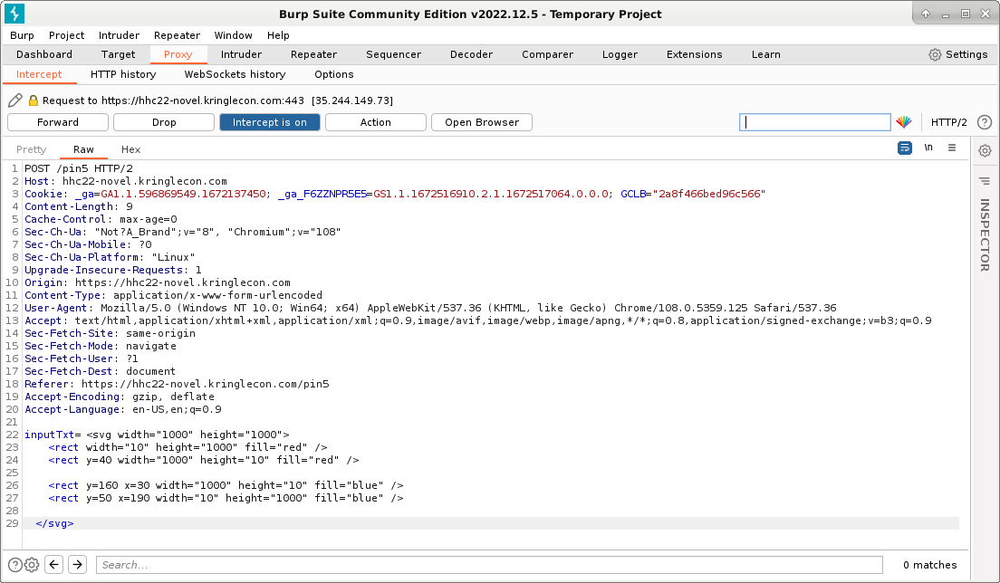
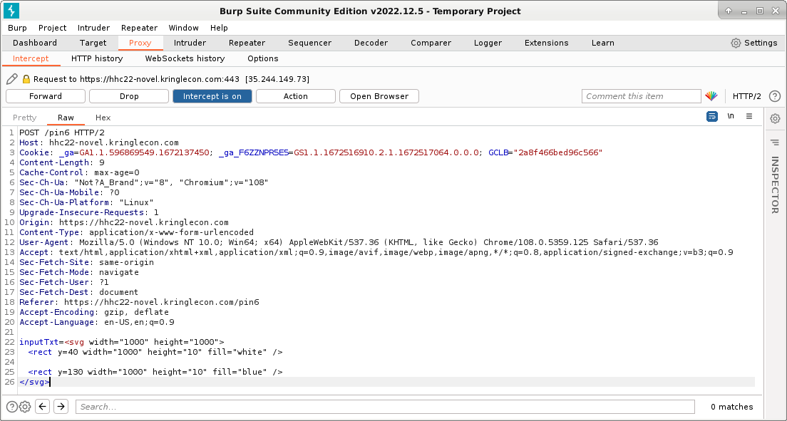
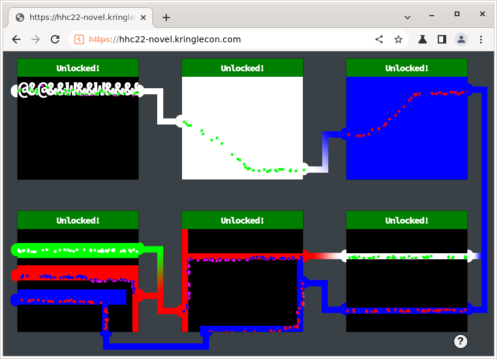

# SANS Holiday Hack Challenge 2022 - KringleCon V: Golden Rings
## Recover the Web Ring
### Open Boria Mine Door
Difficulty: :christmas_tree::christmas_tree::christmas_tree:
Open the door to the Boria Mines. Help Alabaster Snowball in the Web Ring to get some hints for this challenge.

#### Hints
##### Lock Mechanism
*From: Alabaster Snowball*
The locks take input, render some type of image, and process on the back end to unlock. To start, take a good look at the source HTML/JavaScript.
##### Content-Security-Policy
*From: Alabaster Snowball*
Understanding how [Content-Security-Policy](https://cheatsheetseries.owasp.org/cheatsheets/Content_Security_Policy_Cheat_Sheet.html) works can help with this challenge.
##### Input Validation
*From: Alabaster Snowball*
Developers use both client- and server-side [input validation](https://cheatsheetseries.owasp.org/cheatsheets/Input_Validation_Cheat_Sheet.html) to keep out naughty input.

#### Solution
##### Lock #1
First thing I noticed, is that each lock is a iframe on its own, so I opened the source code of the first lock
identifying a comment within the HTML code:
```html
<!DOCTYPE html>
<html lang="en">
<head>
    <meta charset="UTF-8">
    <meta http-equiv="X-UA-Compatible" content="IE=edge">
    <meta name="viewport" content="width=device-width, initial-scale=1.0">
    <title>Lock 1</title>
    <link rel="stylesheet" href="pin.css">
</head>
<body>
    <form method='post' action='pin1'>
        <!-- @&@&&W&&W&&&& -->
        <input class='inputTxt' name='inputTxt' type='text' value='' autocomplete='off' />
        <button>GO</button>
    </form>
    <div class='output'></div>
    
    
    <!-- js -->
    <script src='pin.js'></script>
</body>
</html>
```
The string `@&@&&W&&W&&&&` inside the comment resolves lock #1.

##### Lock #2
The second lock didn’t have comments in the code but considering the suggestion on input sanitization, I thought it was possible to inject HTML. The following line of code solves lock #2:
```html
<div style="background:white; width:1000px; height:1000px"></div>
```

##### Lock #3
Previous solution didn’t work on the third one. With a similar idea, I tried using SVG to draw inside the box. The following line of code solves lock #3:
```html
<svg width="1000" height="1000"><rect width="1000" height="1000" fill="blue" /></svg>
```

##### Lock #4
Same solution of lock #3, just with some more code:
```html
<svg width="1000" height="1000">
  <rect y=23 width="1000" height="25" fill="#00ff00" />
  
  <rect y=60 width="1000" height="25" fill="red" />
  <rect y=60 x=190 width="10" height="1000" fill="red" />
  
  <rect y=100 width="180" height="25" fill="blue" />
  <rect y=100 x=140 width="10" height="1000" fill="blue" />
</svg>
```

##### Lock #5
It was not possible to insert code directly in the input field because of a client side input sanitization inside the HTML code. By injecting the code directly in the request with Burp it was possible to bypass the input sanitization:  
  
The payload used is the following:
```html
<svg width="1000" height="1000">
  <rect width="10" height="1000" fill="red" />
  <rect y=40 width="1000" height="10" fill="red" />
  
  <rect y=160 x=30 width="1000" height="10" fill="blue" />
  <rect y=50 x=190 width="10" height="1000" fill="blue" />
</svg>
```

##### Lock #6
Here I applied the same solution of lock #5:  
  
The payload used is the following:
```html
<svg width="1000" height="1000">
  <rect y=40 width="1000" height="10" fill="white" />

  <rect y=130 width="1000" height="10" fill="blue" />
</svg>
```

#### All Locks!
Just to take a look at my drawing skills:  
  

---
## Recover the Web Ring
### Glamtariel's Fountain
### The Web Ring
## Recover the Cloud Ring
### AWS CLI Intro
### Trufflehog Search
### Exploitation via AWS CLI
## Recover the Burning Ring of Fire
### Buy a Hat
### Blockchain Divination
### Exploit a Smart Contract
### Mistakes were made... the key
### The Burning Ring of Fire
## [Narrative](/README.md#narrative)
## [Conclusions](/README.md#conclusions)
### [The Victors shop](/README.md#the-victors-shop)
### [Inbox (1)](/README.md#inbox-1)
---
## [thedead@dellian:~$ whoami](/README.md#thedeaddellian-whoami)
## KringleCon Orientation
## Recover the Tolkien Ring