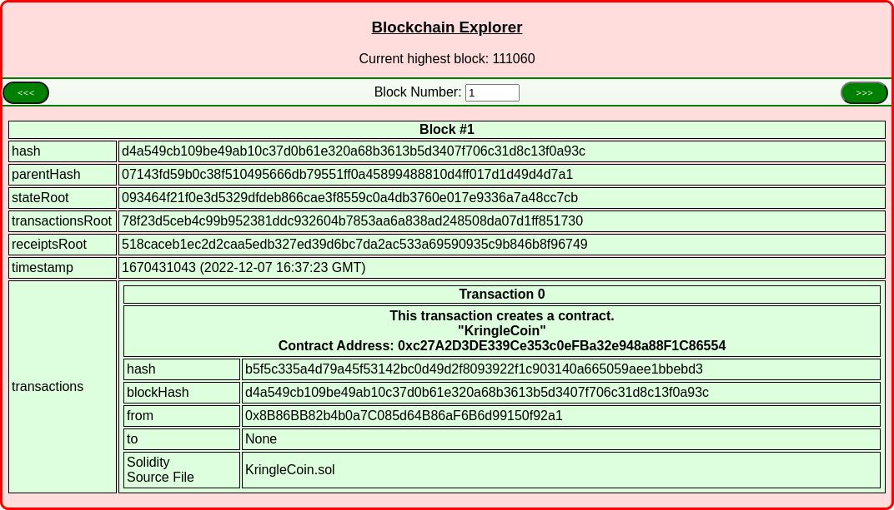

# SANS Holiday Hack Challenge 2022 - KringleCon V: Golden Rings
## Recover the Cloud Ring
### Buy a Hat
Difficulty: :christmas_tree::christmas_tree::christmas_tree::christmas_tree:  
Use the Blockchain Explorer in the Burning Ring of Fire to investigate the contracts and transactions on the chain. At what address is the KringleCoin smart contract deployed? Find hints for this objective hidden throughout the tunnels.

#### Hints
##### A Solid Hint
*From: Hidden Chest - Hall of Talks*
Find a transaction in the blockchain where someone sent or received KringleCoin! The Solidity Source File is listed as `KringleCoin.sol`. [Tom's Talk](https://youtu.be/r3zj9DPC8VY) might be helpful!

#### Solution
Probably should’ve read the hint but instead I went the way around :) I assumed the contract would be toward the beginning of the blockchain, so I started from block #0 and easily found the `KringleCoin.sol` contract at block #1:  
  
The contract address is: `0xc27A2D3DE339Ce353c0eFBa32e948a88F1C86554`.

---
## Recover the Burning Ring of Fire
### Buy a Hat
### Blockchain Divination
### Exploit a Smart Contract
### Mistakes were made... the key
### The Burning Ring of Fire
## [Narrative](/README.md#narrative)
## [Conclusions](/README.md#conclusions)
### [The Victors shop](/README.md#the-victors-shop)
### [Inbox (1)](/README.md#inbox-1)
---
## [thedead@dellian:~$ whoami](/README.md#thedeaddellian-whoami)
## KringleCon Orientation
## Recover the Tolkien Ring