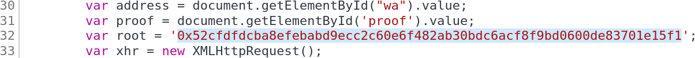
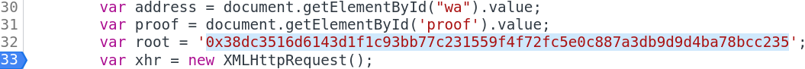

# SANS Holiday Hack Challenge 2022 - KringleCon V: Golden Rings
## Recover The Burning Ring of Fire
### Exploit a Smart Contract
Difficulty: :christmas_tree::christmas_tree::christmas_tree::christmas_tree::christmas_tree:  
Exploit flaws in a smart contract to buy yourself a Bored Sporc NFT. Find hints for this objective hidden throughout the tunnels.

#### Solution
I had no clue where to start, so I started by downloading the blockchain’s content thinking that maybe I could copy from someone who already made it. I wrote the following script ([downloader.py](downloader.py)) to download from the blockchain:
```python
import requests
import os

breaker = False
blocknumber = 0
while not breaker:
	response = requests.post("https://prod-blockbrowser.kringle.co.in/cgi-bin/blockdata", json={"blocknumber": blocknumber})
	if "Invalid block number" in response.text:
		breaker = True
	else:
		with open("blocks/{}".format(blocknumber), 'w') as file:
			file.write(response.text)
		print ("Block #{} wrote {} on file".format(blocknumber, len(response.text)))
		blocknumber += 1
```
Knowing I would have to send money to the address `0xe8fC6f6a76BE243122E3d01A1c544F87f1264d3a`, I searched for it and found block #117 where `0xa1861E96DeF10987E1793c8f77E811032069f8E9` made a transaction with comment `Pre-sale purchase of a BSRS NFT.`. Looking for other blocks related to that address I also found block #118 where the following call was made to the function `presale_mint`:
```solidity
function: presale_mint(address,bytes32,bytes32[])
parameters: {'to': '0xa1861E96DeF10987E1793c8f77E811032069f8E9', '_root': b'\xc4t\x1e\x81\x06[\xff\x02v.\xd3\xce\x06ncY\xc1\xf4ae\x18\xe06\x99\xc8\x882\xef\x84\x91p\x14', '_proof': [b'S\x80\xc7\xb7\xae\x81\xa5\x8e\xb9\x8d\x9cx\xdeJ\x1f\xd7\xfd\x955\xfc\x95>\xd2\xbe`-\xaa\xa4\x17g1*']}
```
Back to square one, I had no clue what that meant but I knew I would have found something in the talks and there it is: [You Can Still Have Fun With Non-Fungible Tokens from Prof Qwerty Petabyte!](https://www.youtube.com/watch?v=Qt_RWBq63S8). At the end the Prof says he’s going to make some code available on github. Didn’t take long to find the [QPetabyte/Merkle_Trees](https://github.com/QPetabyte/Merkle_Trees) github repository. Downloaded, just modified the dummy address with mine, maybe added a `print`, and run the code:
```bash
thedead@dellian:~$ python3 merkle_tree.py 
Wallet: 0x4a831cfc7fD1A983b4AF04CfbF5da984bD6f7E7E
Root: 0x38dc3516d6143d1f1c93bb77c231559f4f72fc5e0c887a3db9d9d4ba78bcc235
Proof: ['0x5380c7b7ae81a58eb98d9c78de4a1fd7fd9535fc953ed2be602daaa41767312a']
```
The proof obviously didn’t work right away, so I started looking around the page and how it worked, discovering it was making a request to https://boredsporcrowboatsociety.com/cgi-bin/presale with payload:
```js
{
  "WalletID": "0x4a831cfc7fD1A983b4AF04CfbF5da984bD6f7E7E",
  "Root": "0x52cfdfdcba8efebabd9ecc2c60e6f482ab30bdc6acf8f9bd0600de83701e15f1",
  "Proof": "0x5380c7b7ae81a58eb98d9c78de4a1fd7fd9535fc953ed2be602daaa41767312a",
  "Validate": "true",
  "Session": "3cfb8093-924f-444d-8820-4bc44f3ed522"
}
```
I went through other transactions I could find in the part of the blockchain I downloaded and noticed all of them had a different `_root` value:
```bash
thedead@dellian:~$ for i in $(grep "Pre-sale purchase of a BSRS NFT." * | cut -d "'" -f4); do root=$(grep $i * | grep "_proof" | cut -d "'" -f 8 | tr -d "\n" | python3 -c "import sys; print (bytes(sys.stdin.buffer.read()).decode('unicode_escape').encode('raw_unicode_escape').hex())") && echo $i $root; done
0xa1861E96DeF10987E1793c8f77E811032069f8E9 c4741e81065bff02762ed3ce066e6359c1f4616518e03699c88832ef84917014
0xc249927fb81bde4eA7B9Dc9e4c9E6F503F147fe2 f2bf4cf6d84d250a1bf695528273f62fff303611e7dd438641e78d6fda44658e
0x8153e0E5cabC22545A1fe4d0149C2Fdc486A8ad8 e5bdb66a84dc18431511e896e41e6fba6f8ac39d939bd9ba38f638b5c8bed9f9
0x7F7cAA97b73fD38d6740e59C159428509eE00082 f07d7ff46fb5917ff10689ae048d82234360664ba651ab584444c1dba6c70853
0xb9aA688bB7A1B085f307bf9a11790BFD24C5D5C2 797a8d998d0cf398b359293779d1b5b12f4bea007719706a7969197e4be125fc
0x8dA96065810cF0623C92D9866Aff86D400d61a42 a1923c132138c61dc1938bd8b1537341d9c575e7bbba8e86f205089694683acc
0xD8EEAf7120E144f9b1de9326D2107992C4318015 9361e25219333c7a8b3c1dfaccdb301880d340290f01c13a89e34c448eb4abb5
0x40d9F41e7a951C301FD7eBCB31E6A96f6C61992e d53bb3cb4648f394794570f7ce6d91b5f111fdc6806dffed36eacdea9e8d666a
0x091B7161d62862a6c7626Af66a657FcdAB52E78f c5b833fb369afa21aecbf38ea248d4c1e63872cf1860aef417f5d414580537a0
0x079f77D988B4396C8c0e501ae507d9D4aAB678BC b25d3c5f3e0f1ae12d710a038897f5fec1cfbfba56f762c842d3a3fb6d9c2edb
0x99cA6f0cfc93255c92BDb8062B3972306508c370 f6a794f037fb668fe73dc5746c6f133ea30fa4e884c46044d14e25a97ea0398c
0xf29b73c985f9aFE42030B5336f3146FB10FAC15e 4ad25ce7d5540a0336af8aea01c38933b8b5398130c31414306c05ab1ac035c3
0xC61a623CE8ea2899CB113ba773156B9dAa73AeC8 c10e1eb45d869b4ee2d00f147ac2231e4cb1ca88b6cde39dcf00f71100367ba9
```
We all know that one-liner is just wrong...I think I have a problem...  
  

Used the wallet addresses in the Prof’s program:
```bash
thedead@dellian:~$ python3 merkle_tree.py 
0xa1861E96DeF10987E1793c8f77E811032069f8E9 c4741e81065bff02762ed3ce066e6359c1f4616518e03699c88832ef84917014
0xc249927fb81bde4eA7B9Dc9e4c9E6F503F147fe2 f2bf4cf6d84d250a1bf695528273f62fff303611e7dd438641e78d6fda44658e
0x8153e0E5cabC22545A1fe4d0149C2Fdc486A8ad8 e5bdb66a84dc18431511e896e41e6fba6f8ac39d939bd9ba38f638b5c8bed9f9
0x7F7cAA97b73fD38d6740e59C159428509eE00082 f5065af767afa3331fdf3fe4e8919311d3671cdc075ea7eeaaad00b82d9b11a0
0xb9aA688bB7A1B085f307bf9a11790BFD24C5D5C2 797a8d998d0cf398b359293779d1b5b12f4bea007719706a7969197e4be125fc
0x8dA96065810cF0623C92D9866Aff86D400d61a42 a1923c132138c61dc1938bd8b1537341d9c575e7bbba8e86f205089694683acc
0xD8EEAf7120E144f9b1de9326D2107992C4318015 9361e25219333c7a8b3c1dfaccdb301880d340290f01c13a89e34c448eb4abb5
0x40d9F41e7a951C301FD7eBCB31E6A96f6C61992e 733fc0984919125249f72f6f56e9064d333b699482ae64cac8168c5f7a7ef2ef
0x091B7161d62862a6c7626Af66a657FcdAB52E78f c5b833fb369afa21aecbf38ea248d4c1e63872cf1860aef417f5d414580537a0
0x079f77D988B4396C8c0e501ae507d9D4aAB678BC b3aa7fbc582ce9dcd7ddb484a8b87806cd630b383815ddba39f0ccde58839054
0x99cA6f0cfc93255c92BDb8062B3972306508c370 f6a794f037fb668fe73dc5746c6f133ea30fa4e884c46044d14e25a97ea0398c
0xf29b73c985f9aFE42030B5336f3146FB10FAC15e 4ad25ce7d5540a0336af8aea01c38933b8b5398130c31414306c05ab1ac035c3
0xC61a623CE8ea2899CB113ba773156B9dAa73AeC8 4ef36e7bfd180e521aba0817111da440cb6ca2b40b232ab6f9ff419db8719756
```
I ran the result values in a spreadsheet to compare (...[hello Excel my old friend](https://www.riffusion.com/?&prompt=hello+Excel+my+old+friend&seed=745235&denoising=0.75&seedImageId=og_beat)...) which confirmed it was not a coincidence:
| Address | merkle_tree.py root | block root | Root Match |
| ------- | ------------------- | ---------- | ---------- |
| `0xa1861E96DeF10987E1793c8f77E811032069f8E9` | `c4741e81065bff02762ed3ce066e6359c1f4616518e03699c88832ef84917014` | `c4741e81065bff02762ed3ce066e6359c1f4616518e03699c88832ef84917014` | `TRUE` |
| `0xc249927fb81bde4eA7B9Dc9e4c9E6F503F147fe2` | `f2bf4cf6d84d250a1bf695528273f62fff303611e7dd438641e78d6fda44658e` | `f2bf4cf6d84d250a1bf695528273f62fff303611e7dd438641e78d6fda44658e` | `TRUE` |
| `0x8153e0E5cabC22545A1fe4d0149C2Fdc486A8ad8` | `e5bdb66a84dc18431511e896e41e6fba6f8ac39d939bd9ba38f638b5c8bed9f9` | `e5bdb66a84dc18431511e896e41e6fba6f8ac39d939bd9ba38f638b5c8bed9f9` | `TRUE` |
| `0x7F7cAA97b73fD38d6740e59C159428509eE00082` | `f5065af767afa3331fdf3fe4e8919311d3671cdc075ea7eeaaad00b82d9b11a0` | `f07d7ff46fb5917ff10689ae048d82234360664ba651ab584444c1dba6c70853` | `FALSE` |
| `0xb9aA688bB7A1B085f307bf9a11790BFD24C5D5C2` | `797a8d998d0cf398b359293779d1b5b12f4bea007719706a7969197e4be125fc` | `797a8d998d0cf398b359293779d1b5b12f4bea007719706a7969197e4be125fc` | `TRUE` |
| `0x8dA96065810cF0623C92D9866Aff86D400d61a42` | `a1923c132138c61dc1938bd8b1537341d9c575e7bbba8e86f205089694683acc` | `a1923c132138c61dc1938bd8b1537341d9c575e7bbba8e86f205089694683acc` | `TRUE` |
| `0xD8EEAf7120E144f9b1de9326D2107992C4318015` | `9361e25219333c7a8b3c1dfaccdb301880d340290f01c13a89e34c448eb4abb5` | `9361e25219333c7a8b3c1dfaccdb301880d340290f01c13a89e34c448eb4abb5` | `TRUE` |
| `0x40d9F41e7a951C301FD7eBCB31E6A96f6C61992e` | `733fc0984919125249f72f6f56e9064d333b699482ae64cac8168c5f7a7ef2ef` | `d53bb3cb4648f394794570f7ce6d91b5f111fdc6806dffed36eacdea9e8d666a` | `FALSE` |
| `0x091B7161d62862a6c7626Af66a657FcdAB52E78f` | `c5b833fb369afa21aecbf38ea248d4c1e63872cf1860aef417f5d414580537a0` | `c5b833fb369afa21aecbf38ea248d4c1e63872cf1860aef417f5d414580537a0` | `TRUE` |
| `0x079f77D988B4396C8c0e501ae507d9D4aAB678BC` | `b3aa7fbc582ce9dcd7ddb484a8b87806cd630b383815ddba39f0ccde58839054` | `b25d3c5f3e0f1ae12d710a038897f5fec1cfbfba56f762c842d3a3fb6d9c2edb` | `FALSE` |
| `0x99cA6f0cfc93255c92BDb8062B3972306508c370` | `f6a794f037fb668fe73dc5746c6f133ea30fa4e884c46044d14e25a97ea0398c` | `f6a794f037fb668fe73dc5746c6f133ea30fa4e884c46044d14e25a97ea0398c` | `TRUE` |
| `0xf29b73c985f9aFE42030B5336f3146FB10FAC15e` | `4ad25ce7d5540a0336af8aea01c38933b8b5398130c31414306c05ab1ac035c3` | `4ad25ce7d5540a0336af8aea01c38933b8b5398130c31414306c05ab1ac035c3` | `TRUE` |
| `0xC61a623CE8ea2899CB113ba773156B9dAa73AeC8` | `4ef36e7bfd180e521aba0817111da440cb6ca2b40b232ab6f9ff419db8719756` | `c10e1eb45d869b4ee2d00f147ac2231e4cb1ca88b6cde39dcf00f71100367ba9` | `FALSE` |

At this point I thought it was safe to assume I should’ve changed the root and I started from the page to understand where it was being set. As soon as I found the file [`bsrs.js`](https://boredsporcrowboatsociety.com/bsrs.js), I knew how much I went overthinking on this as the root is simply being set statically in the JS code. I added a breakpoint and modified the root value on the fly. From this:  
  
To this:  
  
And that’s how Ogres became friendly to me and I got my personal Bored Sporc NFT: BSRS Token `#000452`, Transaction `0x843a495577bbefffb3d8fde9446b271e439849fb32606c8d7df2944f67f2c863` at Block `95513`.

#### [Look at it!](https://boredsporcrowboatsociety.com/TOKENS/TOKENIMAGES/BSRS452.png)


---
### [Mistakes were made… the key (Recover the Burning Ring of Fire)](/06%20-%20Recover%20the%20Burning%20Ring%20of%20Fire/06.04%20-%20Mistakes%20were%20made…%20the%20key/README.md)
### [The Burning Ring of Fire (Recover the Burning Ring of Fire)](/06%20-%20Recover%20the%20Burning%20Ring%20of%20Fire/06.05%20-%20The%20Burning%20Ring%20of%20Fire/README.md)
### [Narrative](/README.md#narrative)
### [Conclusions](/README.md#conclusions)
---
### [thedead@dellian:~$ whoami](/README.md#thedeaddellian-whoami)
### [KringleCon Orientation](/01%20-%20KringleCon%20Orientation/README.md)
### [Wireshark Practice (Recover the Tolkien Ring)](/02%20-%20Recover%20the%20Tolkien%20Ring/02.01%20-%20Wireshark%20Practice/README.md)
### [Windows Event Logs (Recover the Tolkien Ring)](/02%20-%20Recover%20the%20Tolkien%20Ring/02.02%20-%20Windows%20Event%20Logs/README.md)
### [Suricata Regatta (Recover the Tolkien Ring)](/02%20-%20Recover%20the%20Tolkien%20Ring/02.03%20-%20Suricata%20Regatta/README.md)
### [The Tolkien Ring (Recover the Tolkien Ring)](/02%20-%20Recover%20the%20Tolkien%20Ring/02.04%20-%20The%20Tolkien%20Ring/README.md)
### [Clone with a Difference (Recover the Elfen Ring)](/03%20-%20Recover%20the%20Elfen%20Ring/03.01%20-%20Clone%20with%20a%20Difference/README.md)
### [Prison Escape (Recover the Elfen Ring)](/03%20-%20Recover%20the%20Elfen%20Ring/03.02%20-%20Prison%20Escape/README.md)
### [Jolly CI_CD (Recover the Elfen Ring)](/03%20-%20Recover%20the%20Elfen%20Ring/03.03%20-%20Jolly%20CI_CD/README.md)
### [The Elfen Ring (Recover the Elfen Ring)](/03%20-%20Recover%20the%20Elfen%20Ring/03.04%20-%20The%20Elfen%20Ring/README.md)
### [Naughty IP (Recover the Web Ring)](/04%20-%20Recover%20the%20Web%20Ring/04.01%20-%20Naughty%20IP/README.md)
### [Credential Mining (Recover the Web Ring)](/04%20-%20Recover%20the%20Web%20Ring/04.02%20-%20Credential%20Mining/README.md)
### [404 FTW (Recover the Web Ring)](/04%20-%20Recover%20the%20Web%20Ring/04.03%20-%20404%20FTW/README.md)
### [IMDS, XXE, and Other Abbreviations (Recover the Web Ring)](/04%20-%20Recover%20the%20Web%20Ring/04.04%20-%20IMDS,%20XXE,%20and%20Other%20Abbreviations/README.md)
### [Open Boria Mine Door (Recover the Web Ring)](/04%20-%20Recover%20the%20Web%20Ring/04.05%20-%20Open%20Boria%20Mine%20Door/README.md)
### [Glamtariel's Fountain (Recover the Web Ring)](/04%20-%20Recover%20the%20Web%20Ring/04.06%20-%20Glamtariel's%20Fountain/README.md)
### [The Web Ring (Recover the Web Ring)](/04%20-%20Recover%20the%20Web%20Ring/04.07%20-%20The%20Web%20Ring/README.md)
### [AWS CLI Intro (Recover the Cloud Ring)](/05%20-%20Recover%20the%20Cloud%20Ring/05.01%20-%20AWS%20CLI%20Intro/README.md)
### [Trufflehog Search (Recover the Cloud Ring)](/05%20-%20Recover%20the%20Cloud%20Ring/05.02%20-%20Trufflehog%20Search/README.md)
### [Exploitation via AWS CLI (Recover the Cloud Ring)](/05%20-%20Recover%20the%20Cloud%20Ring/05.03%20-%20Exploitation%20via%20AWS%20CLI/README.md)
### [The Cloud Ring (Recover the Cloud Ring)](/05%20-%20Recover%20the%20Cloud%20Ring/05.04%20-%20The%20Cloud%20Ring/README.md)
### [Buy a Hat (Recover the Burning Ring of Fire)](/06%20-%20Recover%20the%20Burning%20Ring%20of%20Fire/06.01%20-%20Buy%20a%20Hat/README.md)
### [Blockchain Divination (Recover the Burning Ring of Fire)](/06%20-%20Recover%20the%20Burning%20Ring%20of%20Fire/06.02%20-%20Blockchain%20Divination/README.md)