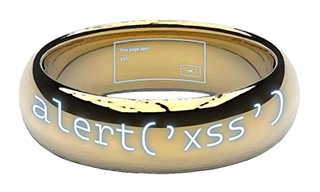
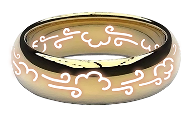
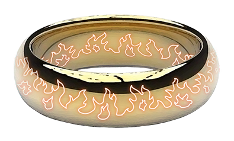
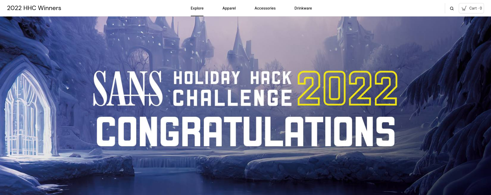
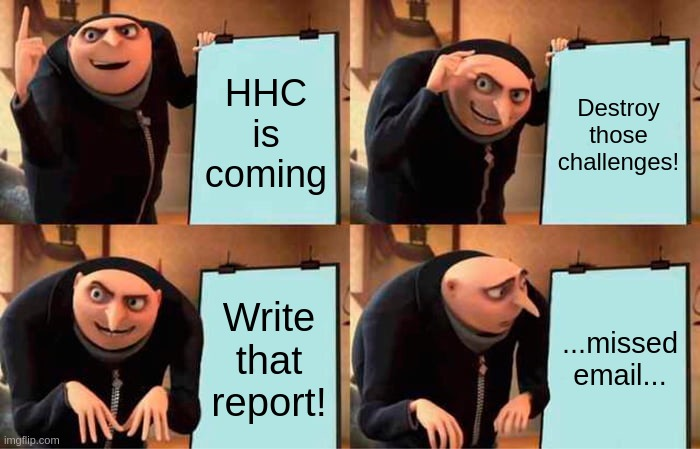

# SANS Holiday Hack Challenge 2022 - KringleCon V: Golden Rings

## Work in progress notice
I am still porting the PDF report to GitHub, therefore it may change over time (even be destroyed by errors :) ).
The only currently "stable" release is the PDF itself (thought I already noticed minor changes I'll have to fix).
The PDF is available here: [Lamonato Andrea - Writeup for SANS Holiday Hack Challenge 2022.pdf](https://github.com/LamonatoAndrea/KringleCon5/blob/master/Lamonato%20Andrea%20-%20Writeup%20for%20SANS%20Holiday%20Hack%20Challenge%202022.pdf).

## thedead@dellian:~$ whoami
```bash
thedead@dellian:~$ whoami

Andrea Lamonato

Cyber Security Engineer

mailto: lamonato.andrea@gmail.com
Github: https://github.com/LamonatoAndrea
Linkedin: https://www.linkedin.com/in/andrea-lamonato/

Hopefully, your worst one-liner of the season:
    ➤    __________________________________________
    ➤   / for i in $(grep "Pre-sale purchase of a  \
    ➤   | BSRS NFT." * | cut -d "'" -f4); do       |
    ➤   | root=$(grep $i * | grep "_proof" | cut   |
    ➤   | -d "'" -f 8 | tr -d "\n" | python3 -c    |
    ➤   | "import sys; print (bytes(sys.stdin.buff |
    ➤   | er.read()).decode('unicode_escape').enco |
    ➤   | de('raw_unicode_escape').hex())") &&     |
    ➤   \ echo $i $root; done                      /
    ➤    ------------------------------------------
    ➤            \   ^__^ 
    ➤             \  (oo)\_______
    ➤                (__)\       )\/\
    ➤                    ||----w |
    ➤                    ||     ||
```

## KringleCon Orientation

## Recover the Tolkien Ring

### Wireshark Practice

### Windows Event Logs

### Suricata Regatta

### The Tolkien Ring
Just to take a good look at the Tolkien Ring recovered from previous challenges :)  


## Recover the Elfen Ring

### Clone with a Difference

### Prison Escape

### Jolly CI/CD

### The Elfen Ring
Just to take a good look at the Elfen Ring recovered from previous challenges :)  


## Recover the Web Ring

### Naughty IP

### Credential Mining

### 404 FTW

### IMDS, XXE, and Other Abbreviations

### Open Boria Mine Door

### Glamtariel's Fountain

### The Web Ring
Just to take a good look at the Web Ring recovered from previous challenges :)  


## Recover the Cloud Ring

### AWS CLI Intro

### Trufflehog Search

### Exploitation via AWS CLI

### The Cloud Ring
Just to take a good look at the Cloud Ring recovered from previous challenges :)  


## Recover the Burning Ring of Fire

### Buy a Hat

### Blockchain Divination

### Exploit a Smart Contract

### Mistakes were made... the key

### The Burning Ring of Fire
Just to take a good look at the Burning Ring of Fire recovered from previous challenges :)  


## Narrative
*Five Rings for the Christmas king immersed in cold*

*Each Ring now missing from its zone*

*The first with bread kindly given, not sold*

*Another to find 'ere pipelines get owned*

*One beneath a fountain where water flowed*

*Into clouds Grinchum had the fourth thrown*

*The fifth on blockchains where shadows be bold*

*One hunt to seek them all, five quests to find them*

*One player to bring them all, and Santa Claus to bind them*

## Conclusions
Hey folks, nice seeing you again! Thanks for this year’s challenge. Must admit it was a twist with respect
to previous years, most objectives felt kinda easier while the Glamtariel's Fountain was much more on the
CTF side. I must admit I missed Jack, but now I’ll just be looking forward to next year’s adventure!

### The Victors shop
Just to add a note that it exists and Eve Snowshoes told me it is at [https://my-store-d61669.creator-spring.com/](https://my-store-d61669.creator-spring.com/)!


### Inbox (1)
I must admit I saw that email just this year while doing the report! Really sorry for this but you deserve an
answer and you’ll get it as soon as this report is uploaded. Who's “you”? One of the images below should
be a hint on that, the other a response :)

